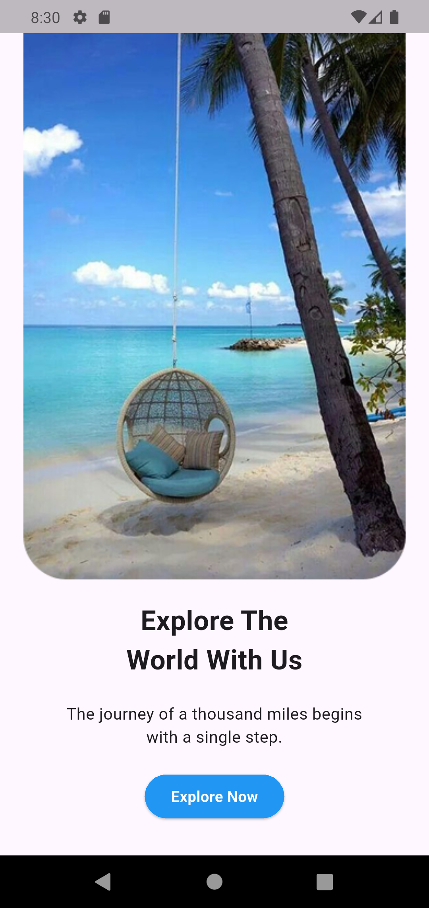

# 🌍 Travel App UI (Flutter)

A modern and clean travel landing screen built using Flutter.  
This project focuses on UI design and layout structuring.

---

## ✨ Features

- Beautiful travel landing screen
- Clean and modern UI
- Responsive layout
- Organized Flutter code structure
- Beginner-friendly project

---

## 📱 Screenshots



---

## 🛠️ Built With

- Flutter
- Dart

---

## 🚀 Getting Started

To run this project:

```bash
git clone https://github.com/YOUR-USERNAME/YOUR-REPO-NAME.git
cd YOUR-REPO-NAME
flutter pub get
flutter run
## 📌 Notes

- This project is a UI-only implementation (no backend functionality).
- Designed as part of Flutter learning and practice.
- Focuses on layout, styling, and clean code structure.
- Can be extended with navigation, API integration, and animations.
- Suitable for beginners building their Flutter portfolio.
